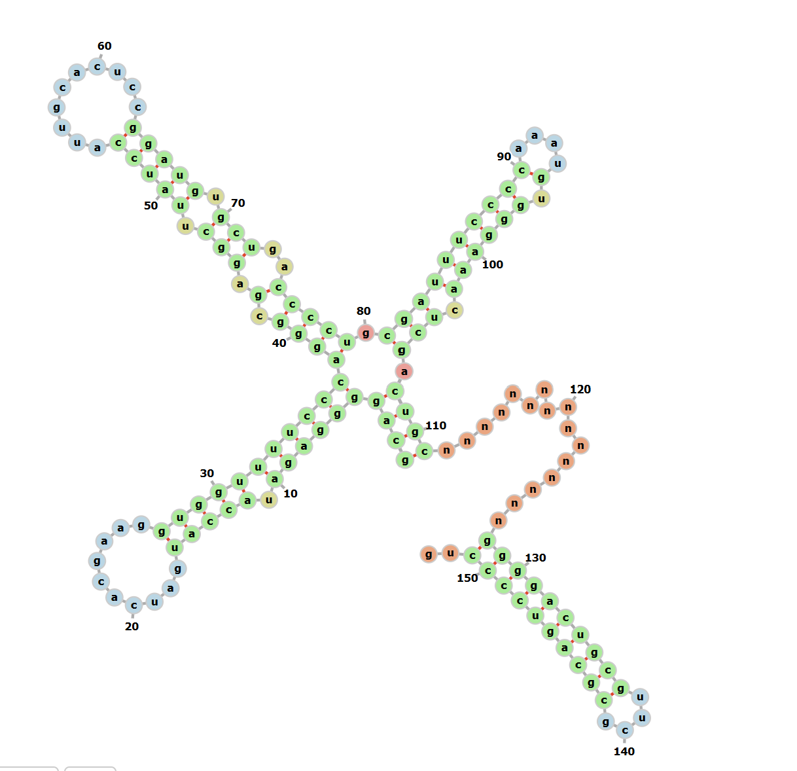
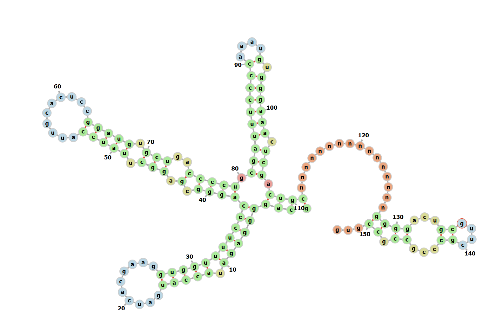
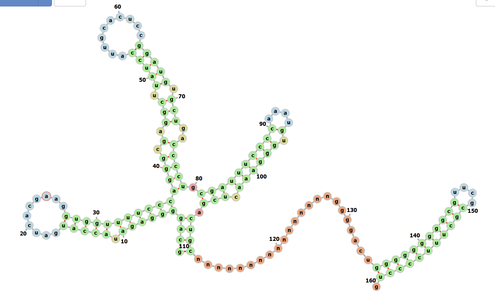
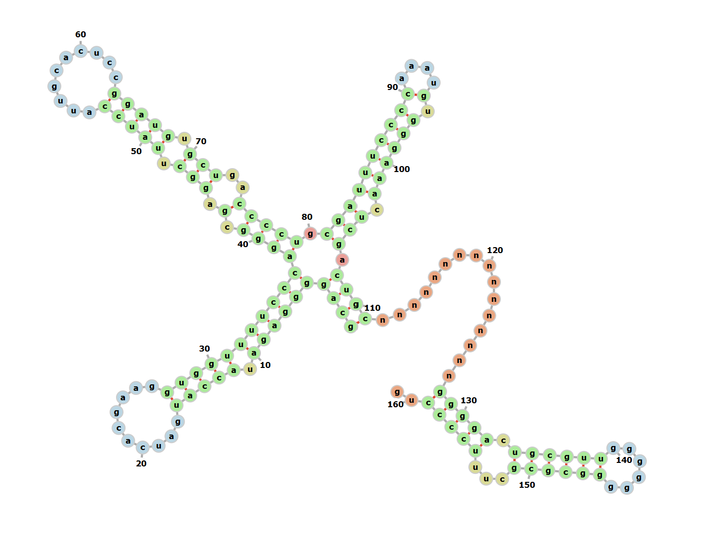
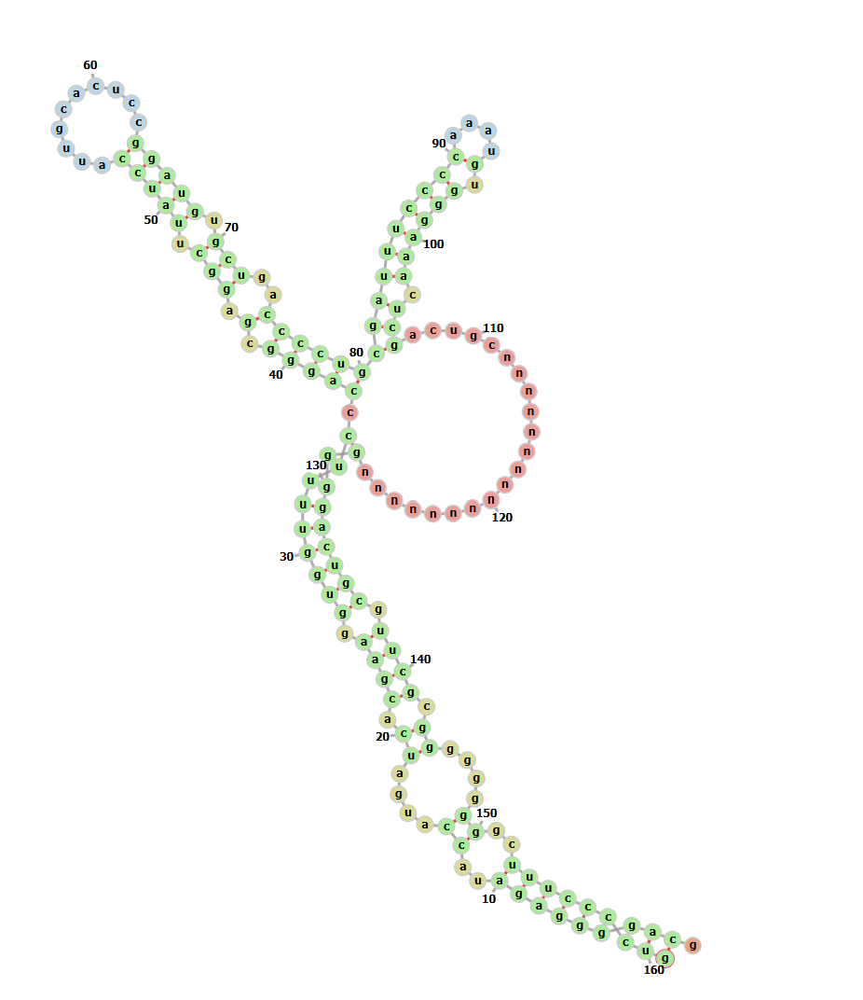
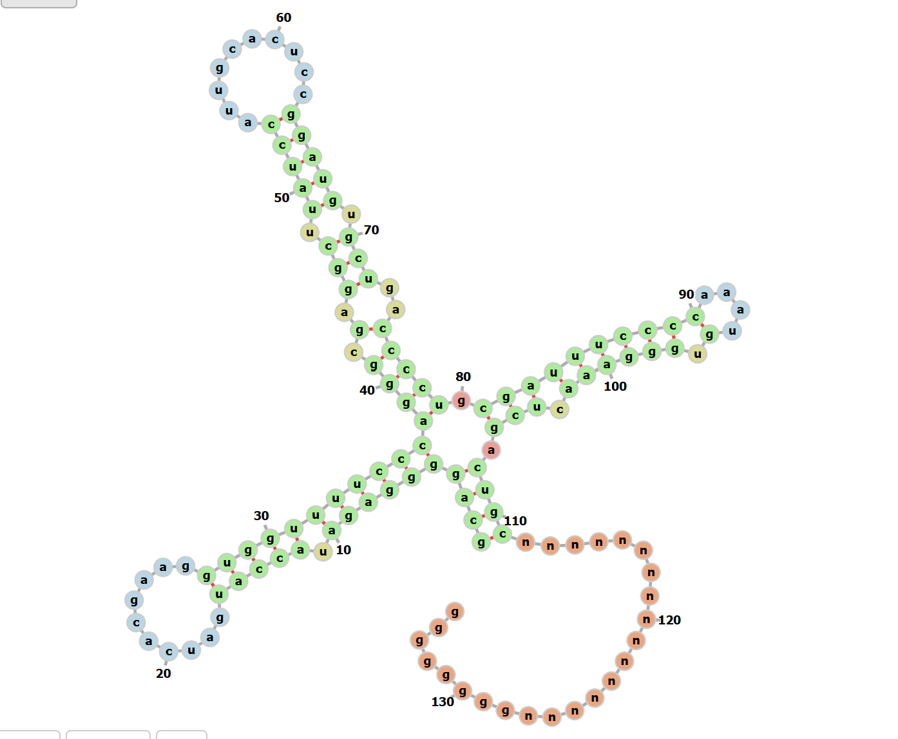

>og sequence

gcaggggagataccatgatcacgaaggtggttttcccagggcgaggcttatccattgcactccggatgtgctgacccctgcgatttccccaaatgtgggaaactcgactgc**ataatttgtggtagtg**ggggactgcgttcgcgctttcccctg

>with the 'nnnnns" replacing

gcaggggagauaccaugaucacgaaggugguuuucccagggcgaggcuuauccauugcacuccggaugugcugaccccugcgauuuccccaaaugugggaaacucgacugc**nnnnnnnnnnnnnnnn**ggggacugcguucgcgcuuuccccug

>with a mutation: u->a (146), u->g (147)

gcaggggagauaccaugaucacgaaggugguuuucccagggcgaggcuuauccauugcacuccggaugugcugaccccugcgauuuccccaaaugugggaaacucgacugcnnnnnnnnnnnnnnnnggggacugcguucgcgcaguccccug

>with ggggacugc->ggcggcggc (132), gcuuucccc->ccgccgccg (147)

gcaggggagauaccaugaucacgaaggugguuuucccagggcgaggcuuauccauugcacuccggaugugcugaccccugcgauuuccccaaaugugggaaacucgacugcnnnnnnnnnnnnnnnnggggacugcguucgcccgccgccgug

>with g-quadruplex before hairpin gggggggg (136)

gcaggggagauaccaugaucacgaaggugguuuucccagggcgaggcuuauccauugcacuccggaugugcugaccccugcgauuuccccaaaugugggaaacucgacugcnnnnnnnnnnnnnnnnggggacugggggggggcguucgcgcuuuccccug

>with g-quadruplex in hairpin gggggggg (140)

gcaggggagauaccaugaucacgaaggugguuuucccagggcgaggcuuauccauugcacuccggaugugcugaccccugcgauuuccccaaaugugggaaacucgacugcnnnnnnnnnnnnnnnnggggacugcguuggggggggcgcgcuuuccccug

>with g-quadruplex after hairpin gggggggg (148)

gcaggggagauaccaugaucacgaaggugguuuucccagggcgaggcuuauccauugcacuccggaugugcugaccccugcgauuuccccaaaugugggaaacucgacugcnnnnnnnnnnnnnnnnggggacugcguucgcgggggggggcuuuccccug

>no hairpin just a g-plex
gcaggggagauaccaugaucacgaaggugguuuucccagggcgaggcuuauccauugcacuccggaugugcugaccccugcgauuuccccaaaugugggaaacucgacugcnnnnnnnnnnnnnnnngggggggg

>short, stable hairpin
gcaggggagauaccaugaucacgaaggugguuuucccagggcgaggcuuauccauugcacuccggaugugcugaccccugcgauuuccccaaaugugggaaacucgacugcnnnnnnnnnnnnnnnngcgcguucgcgcgu

>same hairpin, longer stem of gccgcc
gcaggggagauaccaugaucacgaaggugguuuucccagggcgaggcuuauccauugcacuccggaugugcugaccccugcgauuuccccaaaugugggaaacucgacugcnnnnnnnnnnnnnnnnggggacugcccgccguucgccggcgggcuuuccccug
